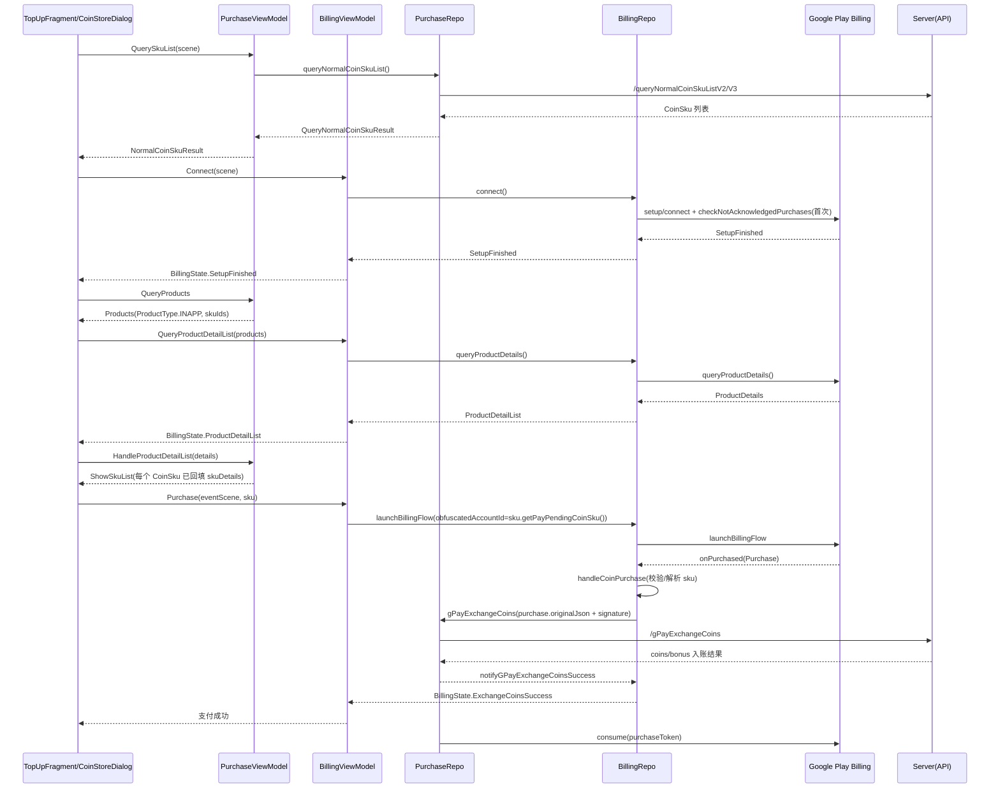

# 短剧 App｜购买金币设计与实现

## 1. 背景与目标

金币充值是“商业化三线并行”中的一条主线：用户通过 Google Play 一次性内购购买金币（或相关活动 SKU），用于后续解锁剧集/单集/权益。

本设计文档聚焦“购买金币”链路本身，详细描述客户端从展示 SKU → 拉起支付 → 服务端对账发放金币 → 消耗/补单恢复的实现过程。

范围包含：
- 金币 SKU 列表与展示（含部分运营扩展 SKU：膨胀、折扣、黑五等）
- Google Play Billing（通过 `com.shorttv.aar.billing` 封装库接入）
- 服务端兑换（验签、幂等、入账）
- Consume（消耗一次性内购）与补单（Not Acknowledged / Item Already Owned）

不在本文范围：
- 广告变现、订阅、解锁编排（见商业化整体文档）

关联文档：
- [短剧 App 亮点 2｜商业化三线并行详细设计](file:///Users/chenxunlin/trace-workspace/shortTV/%E8%AE%BE%E8%AE%A1%E6%96%87%E6%A1%A3/%E7%9F%AD%E5%89%A7%20App%20%E4%BA%AE%E7%82%B9%202%EF%BD%9C%E5%95%86%E4%B8%9A%E5%8C%96%E4%B8%89%E7%BA%BF%E5%B9%B6%E8%A1%8C%E8%AF%A6%E7%BB%86%E8%AE%BE%E8%AE%A1.md)

---

## 2. 总体架构（分层）

### 2.1 UI 层（页面/弹窗）

典型入口：
- 充值页：TopUpFragment（展示金币 SKU + 可选订阅 SKU）  
  - [TopUpFragment.kt](file:///Users/chenxunlin/trace-workspace/shortTV/app/src/main/java/com/startshorts/androidplayer/ui/fragment/purchase/TopUpFragment.kt)
- 播放/解锁链路的金币商店弹窗：CoinStoreDialog  
  - [CoinStoreDialog.kt](file:///Users/chenxunlin/trace-workspace/shortTV/app/src/main/java/com/startshorts/androidplayer/ui/fragment/purchase/v2/CoinStoreDialog.kt)
- 折扣/膨胀等特定场景弹窗：SkuExpansionDialog、DiscountSkuFeature 等

UI 职责：
- 触发“拉取 SKU 列表”
- 触发“连接 Billing / 查询 ProductDetails”
- 点击 SKU → 触发购买
- 订阅 Billing 状态与兑换结果，刷新列表/余额、给出提示

### 2.2 ViewModel 层（状态机与编排）

拆分为两个 ViewModel（核心设计点：把“SKU 列表/组装 Product 请求”与“Billing 连接/支付状态”解耦）：

- PurchaseViewModel：负责服务端 SKU 列表、组装 Google 查询参数、把 ProductDetails 回填到 SKU 上  
  - [PurchaseViewModel.kt](file:///Users/chenxunlin/trace-workspace/shortTV/app/src/main/java/com/startshorts/androidplayer/viewmodel/purchase/PurchaseViewModel.kt)
- BillingViewModel：负责 BillingClient 生命周期、拉起支付、恢复补单、把结果转成 UI 可观察状态  
  - [BillingViewModel.kt](file:///Users/chenxunlin/trace-workspace/shortTV/app/src/main/java/com/startshorts/androidplayer/viewmodel/billing/BillingViewModel.kt)

### 2.3 Repo 层（对外依赖封装）

- BillingRepo / BillingRemoteDS / BillingLocalDS：Billing SDK 封装与本地缓存（价格信息等）  
  - [BillingRepo.kt](file:///Users/chenxunlin/trace-workspace/shortTV/app/src/main/java/com/startshorts/androidplayer/repo/billing/BillingRepo.kt)
  - [BillingRemoteDS.kt](file:///Users/chenxunlin/trace-workspace/shortTV/app/src/main/java/com/startshorts/androidplayer/repo/billing/BillingRemoteDS.kt)
- PurchaseRepo / PurchaseRemoteDS / PurchaseLocalDS：服务端 SKU 列表与“金币兑换”接口  
  - [PurchaseRepo.kt](file:///Users/chenxunlin/trace-workspace/shortTV/app/src/main/java/com/startshorts/androidplayer/repo/billing/purchase/PurchaseRepo.kt)
  - [PurchaseRemoteDS.kt](file:///Users/chenxunlin/trace-workspace/shortTV/app/src/main/java/com/startshorts/androidplayer/repo/billing/purchase/PurchaseRemoteDS.kt)

---

## 3. 关键数据模型

### 3.1 CoinSku：金币商品的统一模型

CoinSku 来自服务端，包含运营字段（coins、bonus、角标、活动价等）与 Google Play SKU ID（`gpSkuId`）。  
- [CoinSku.kt](file:///Users/chenxunlin/trace-workspace/shortTV/app/src/main/java/com/startshorts/androidplayer/bean/purchase/CoinSku.kt)

关键字段：
- `gpSkuId`：Google Play productId
- `skuProductId / skuModelConfigId / prizeId`：服务端对账用的 SKU 识别信息
- `skuDetails`：Google 返回的 ProductDetails / SkuDetails（用于 `launchBillingFlow`）

### 3.2 “防丢单/防串单”关键：obfuscatedAccountId 编码

启动支付时会把“必要的 SKU 元信息”编码到 `obfuscatedAccountId`，由 Google Play 在 Purchase 回调中带回。  
编码入口：`CoinSku.getPayPendingCoinSku()`  
 - [CoinSku.getPayPendingCoinSku](file:///Users/chenxunlin/trace-workspace/shortTV/app/src/main/java/com/startshorts/androidplayer/bean/purchase/CoinSku.kt#L88-L99)

回调解码入口：`Purchase.parseCoinSku()`  
- [PurchaseExt.parseCoinSku](file:///Users/chenxunlin/trace-workspace/shortTV/app/src/main/java/com/startshorts/androidplayer/utils/ext/PurchaseExt.kt#L19-L83)

它解决两个常见问题：
- App 重启后才收到购买回调：内存中的“用户点击的 SKU”已丢失
- 用户先点 A SKU 发起支付，回调延迟；期间又点 B SKU：回调的 `gpSkuId` 与内存记录不一致

---

## 4. 主流程（从“展示”到“入账”）

下面以“充值页 TopUpFragment”链路为例描述整体流程，CoinStoreDialog 等场景相同（只是 eventScene/埋点与 UI 呈现不同）。

### 4.1 时序图（简化）

---

## 5. 详细实现过程（按步骤拆解）

### 5.1 第一步：拉取金币 SKU 列表（服务端）

入口在 PurchaseViewModel：
- `PurchaseIntent.QuerySkuList(scene)` → `queryNormalCoinSkuList(scene)`  
  - [PurchaseViewModel.kt](file:///Users/chenxunlin/trace-workspace/shortTV/app/src/main/java/com/startshorts/androidplayer/viewmodel/purchase/PurchaseViewModel.kt#L114-L202)

核心调用：
- `PurchaseRepo.queryNormalCoinSkuList()`  
  - [PurchaseRepo.queryNormalCoinSkuList](file:///Users/chenxunlin/trace-workspace/shortTV/app/src/main/java/com/startshorts/androidplayer/repo/billing/purchase/PurchaseRepo.kt#L47-L77)
- `PurchaseRemoteDS.queryNormalCoinSkuList()`（根据 AB 实验走 V2/V3）  
  - [PurchaseRemoteDS.queryNormalCoinSkuList](file:///Users/chenxunlin/trace-workspace/shortTV/app/src/main/java/com/startshorts/androidplayer/repo/billing/purchase/PurchaseRemoteDS.kt#L26-L35)

产出：
- UI 先拿到“服务端 SKU 列表”（此时还没有 Google 的 ProductDetails），用于占位渲染与后续组装查询参数。

### 5.2 第二步：连接 Billing（并触发首次自动补单扫描）

入口在 BillingViewModel：
- `BillingIntent.Connect(scene)` → `connect()`  
  - [BillingViewModel.connect](file:///Users/chenxunlin/trace-workspace/shortTV/app/src/main/java/com/startshorts/androidplayer/viewmodel/billing/BillingViewModel.kt#L180-L239)

BillingRepo 初始化监听（关键行为）：
- `onPurchased`：把 Purchase 回调按 `SUBS_FLAG` 分流到订阅或金币处理  
  - [BillingRepo.kt](file:///Users/chenxunlin/trace-workspace/shortTV/app/src/main/java/com/startshorts/androidplayer/repo/billing/BillingRepo.kt#L61-L74)
- 首次 connect 成功会调用 `checkNotAcknowledgedPurchases(createOpId())` 扫描未确认订单  
  - [BillingRemoteDS.connect](file:///Users/chenxunlin/trace-workspace/shortTV/app/src/main/java/com/startshorts/androidplayer/repo/billing/BillingRemoteDS.kt#L66-L107)

设计意图：
- “补单”能力不依赖用户手动点恢复：首次连接成功就能自动处理部分丢单场景。

### 5.3 第三步：查询 Google 的 ProductDetails（把 skuDetails 回填到 CoinSku 上）

PurchaseViewModel 负责组装 products：
- `PurchaseIntent.QueryProducts` → `queryProducts()`  
  - [PurchaseViewModel.queryProducts](file:///Users/chenxunlin/trace-workspace/shortTV/app/src/main/java/com/startshorts/androidplayer/viewmodel/purchase/PurchaseViewModel.kt#L269-L314)

BillingViewModel 负责发起查询：
- `BillingIntent.QueryProductDetailList(list)` → `BillingRepo.queryProductDetails()`  
  - [BillingViewModel.queryProductDetailList](file:///Users/chenxunlin/trace-workspace/shortTV/app/src/main/java/com/startshorts/androidplayer/viewmodel/billing/BillingViewModel.kt#L241-L244)
  - [BillingRemoteDS.queryProductDetails](file:///Users/chenxunlin/trace-workspace/shortTV/app/src/main/java/com/startshorts/androidplayer/repo/billing/BillingRemoteDS.kt#L290-L318)

回填细节：
- Billing 返回 ProductDetails 后，UI 调用 `PurchaseIntent.HandleProductDetailList(list)`，在 `handleProductDetailList` 中执行 `CoinSku.setSkuDetails(list)` 将 ProductDetails 回写到每个 SKU 上，供后续支付使用  
  - [PurchaseViewModel.handleProductDetailList](file:///Users/chenxunlin/trace-workspace/shortTV/app/src/main/java/com/startshorts/androidplayer/viewmodel/purchase/PurchaseViewModel.kt#L316-L389)
  - setSkuDetails 的实现位于 SkuExt（同时会设置 priceText 等展示字段）  
    - [SkuExt.kt](file:///Users/chenxunlin/trace-workspace/shortTV/app/src/main/java/com/startshorts/androidplayer/utils/ext/SkuExt.kt)

为什么要“服务端 SKU 列表 + Google ProductDetails”两段式？
- 服务端 SKU 决定“卖什么/怎么卖/运营字段/风控策略”
- Google ProductDetails 决定“能不能买/本地货币价格/用于拉起支付的 details 对象”
- 两者合并后才能完整展示与发起支付

### 5.4 第四步：拉起支付（launchBillingFlow）

入口在 BillingViewModel：
- `BillingIntent.Purchase(eventScene, activity, sku, episode)`  
  - [BillingViewModel.purchase](file:///Users/chenxunlin/trace-workspace/shortTV/app/src/main/java/com/startshorts/androidplayer/viewmodel/billing/BillingViewModel.kt#L246-L279)

关键校验：
- `BillingRepo.supportOneTimePurchase`（设备/环境不支持则给出提示并上报）  
  - 同上链接
- `sku.skuDetails != null`（若未回填 ProductDetails，会认为不可购买）

启动支付时注入 obfuscatedAccountId：
- `val obfuscatedAccountId = sku.getPayPendingCoinSku()`  
  - [BillingRepo.launchBillingFlow (coin)](file:///Users/chenxunlin/trace-workspace/shortTV/app/src/main/java/com/startshorts/androidplayer/repo/billing/BillingRepo.kt#L140-L167)

### 5.5 第五步：处理 Purchase 回调（校验、解析、对账兑换）

Purchase 回调入口（RemoteDS → Repo）：
- `BillingRemoteDS.OnBillingAdapter.onPurchased()` → `BillingRepo.handleCoinPurchase(opId, purchase)`  
  - [BillingRemoteDS.onPurchased](file:///Users/chenxunlin/trace-workspace/shortTV/app/src/main/java/com/startshorts/androidplayer/repo/billing/BillingRemoteDS.kt#L138-L142)
  - [BillingRepo.handleCoinPurchase](file:///Users/chenxunlin/trace-workspace/shortTV/app/src/main/java/com/startshorts/androidplayer/repo/billing/BillingRepo.kt#L250-L321)

核心逻辑（简化解释）：
1. 优先使用 `mLaunchBillingFlowCoinSku` 作为“本次点击的 SKU”  
2. 若为空（App 重启等）：用 `purchase.parseCoinSku()` 从 `obfuscatedAccountId` 恢复 SKU  
3. 若 `gpSkuId` 与内存记录不一致（延迟回调/多次点击）：同样使用 `purchase.parseCoinSku()` 纠偏  
4. 从 BillingLocalDS 取 `priceInfo`（本地币种价格）；若取不到且 SKU 有美元价格字段，则降级补齐  
5. 调用服务端兑换：`PurchaseRepo.gPayExchangeCoins(...)`（携带 `purchase.originalJson + purchase.signature`）

### 5.6 第六步：服务端发币成功后，刷新余额并 consume

服务端兑换入口：
- [PurchaseRemoteDS.gPayExchangeCoins](file:///Users/chenxunlin/trace-workspace/shortTV/app/src/main/java/com/startshorts/androidplayer/repo/billing/purchase/PurchaseRemoteDS.kt#L42-L64)

成功后客户端行为：
- `AccountRepo.updateCoinsAndBonus(coins, bonus)` 刷新余额
- 发送 `UserRechargedEvent()` 通知 UI
- `BillingRepo.notifyGPayExchangeCoinsSuccess(...)` 回传 UI 状态  
  - [PurchaseRepo.gPayExchangeCoins](file:///Users/chenxunlin/trace-workspace/shortTV/app/src/main/java/com/startshorts/androidplayer/repo/billing/purchase/PurchaseRepo.kt#L147-L191)
- 非折扣 SKU 执行 `consume(INAPP, purchaseToken)`，释放“可再次购买”能力  
  - 同上链接（`if (!coinSku.gpSkuId.contains(BillingRepo.DISCOUNT_FLAG)) { ... consume(...) }`）

---

## 6. 补单与恢复（Not Acknowledged / Item Already Owned）

### 6.1 自动补单（首次连接成功触发）

BillingRemoteDS setup 成功后，如果是“首次连接”，会调用：
- `checkNotAcknowledgedPurchases(createOpId())`  
  - [BillingRemoteDS.connect](file:///Users/chenxunlin/trace-workspace/shortTV/app/src/main/java/com/startshorts/androidplayer/repo/billing/BillingRemoteDS.kt#L80-L87)

BillingRepo 的处理入口：
- `handleNotAcknowledgedPurchases(auto, eventScene, purchases)`  
  - [BillingRepo.handleNotAcknowledgedPurchases](file:///Users/chenxunlin/trace-workspace/shortTV/app/src/main/java/com/startshorts/androidplayer/repo/billing/BillingRepo.kt#L497-L565)

流程要点：
- 把 Purchase 分成 INAPP 与 SUBS 两组
- 对 INAPP：用 `parseCoinSku()` 还原 SKU（折扣 SKU 额外校验 shortPlayId 是否存在），构造 `GPayCoinsRecover` 列表
- 调用服务端 `gPayCoinsRecover(...)` 进行对账补发
- 成功后对每个 token 执行 `consume`，避免重复补单

### 6.2 手动恢复入口（UI 触发）

BillingViewModel 提供手动入口：
- `BillingIntent.QueryNotAcknowledgedPurchases(eventScene)`  
  - [BillingViewModel.queryNotAcknowledgedPurchases](file:///Users/chenxunlin/trace-workspace/shortTV/app/src/main/java/com/startshorts/androidplayer/viewmodel/billing/BillingViewModel.kt#L332-L360)

UI 在金币页/商店中通常提供“恢复购买/补单”按钮（例如充值页、商店弹窗），点击后触发该 intent。

### 6.3 Item Already Owned：支付失败时的自愈

当拉起支付失败且错误为 `ITEM_ALREADY_OWNED` 时，BillingRemoteDS 会自动触发一次补单扫描：
- [BillingRemoteDS.onError](file:///Users/chenxunlin/trace-workspace/shortTV/app/src/main/java/com/startshorts/androidplayer/repo/billing/BillingRemoteDS.kt#L147-L201)

该策略用于处理：
- 用户已完成支付但未 consume，导致再次购买被 Google 拒绝
- 通过补单恢复 + consume，把状态修复到“可再次购买”

---

## 7. 边界场景与处理策略

### 7.1 未拿到 skuDetails

现象：服务端 SKU 有，但 Google ProductDetails 查询失败或未回填，导致无法购买。  
策略：
- BillingViewModel 中会将此视为购买失败并提示（同时上报埋点）  
  - [BillingViewModel.purchase](file:///Users/chenxunlin/trace-workspace/shortTV/app/src/main/java/com/startshorts/androidplayer/viewmodel/billing/BillingViewModel.kt#L246-L277)

### 7.2 用户快速连点导致重复拉起支付

BillingRepo 做了 1s 节流：
- `MIN_LAUNCH_BILLING_FLOW_TIME = 1000ms`  
  - [BillingRepo.launchBillingFlow (coin)](file:///Users/chenxunlin/trace-workspace/shortTV/app/src/main/java/com/startshorts/androidplayer/repo/billing/BillingRepo.kt#L56-L167)

### 7.3 回调延迟/串单

策略：以 `purchase.products[0]` 的 `gpSkuId` 为准，如果与内存记录不一致则尝试从 `obfuscatedAccountId` 反解 SKU 自愈。  
- [BillingRepo.handleCoinPurchase](file:///Users/chenxunlin/trace-workspace/shortTV/app/src/main/java/com/startshorts/androidplayer/repo/billing/BillingRepo.kt#L250-L321)
- [PurchaseExt.parseCoinSku](file:///Users/chenxunlin/trace-workspace/shortTV/app/src/main/java/com/startshorts/androidplayer/utils/ext/PurchaseExt.kt#L19-L83)

### 7.4 服务端成功但客户端未收到回调（丢单）

策略：
- 首次连接自动扫未确认订单
- 用户可手动触发恢复
- `ITEM_ALREADY_OWNED` 时自动触发补单扫描

---

## 8. 安全与一致性（实现约束）

- 服务端权威：金币/bonus 的最终入账以服务端返回为准；客户端仅做展示与缓存更新
- 验签与幂等：兑换接口携带 `purchaseData + signature`，服务端应完成验签、幂等入账、防重放
- 可恢复：所有“未 consume 的一次性内购”都应能通过补单路径恢复并 consume，避免用户资产丢失
- 价格一致性：埋点/对账优先使用 Google 返回的本地货币价格（BillingLocalDS）；拿不到时用服务端美元字段降级，但需在服务端侧二次校验

---

## 9. 本地联调/验证建议

建议按以下用例验证链路：
1. 正常购买金币：成功后余额更新、toast/弹窗提示、SKU 列表刷新、可再次购买
2. App 重启后回调：发起购买后杀进程，等待回调/下次启动补单，余额能恢复
3. ITEM_ALREADY_OWNED：构造未 consume 的 purchase，再次购买能自动触发补单并恢复
4. 价格回填失败：断网/拦截 ProductDetails，确认 UI 给出不可购买提示
5. 折扣/批量解锁 SKU：验证 `obfuscatedAccountId` 解析与服务端入账参数是否正确

