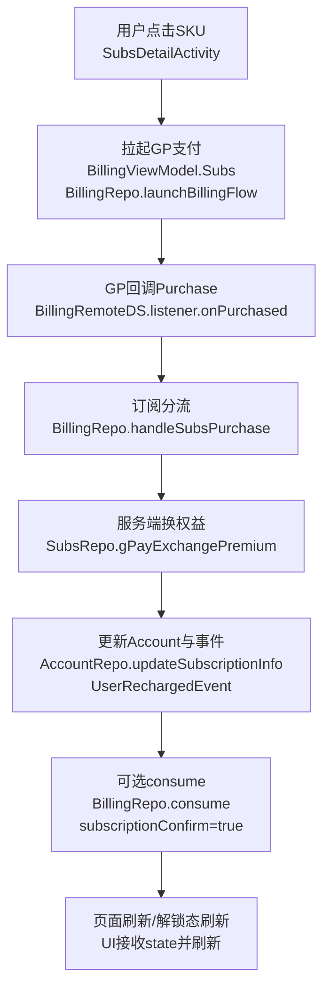
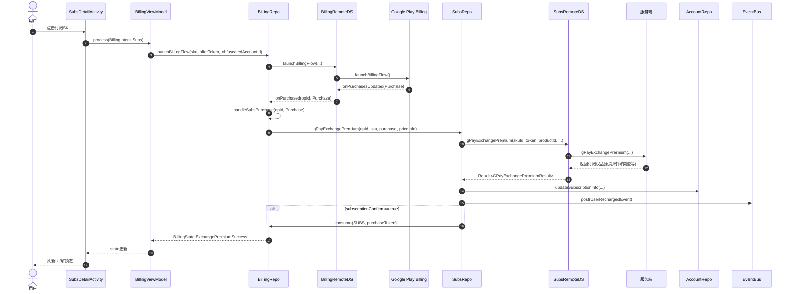
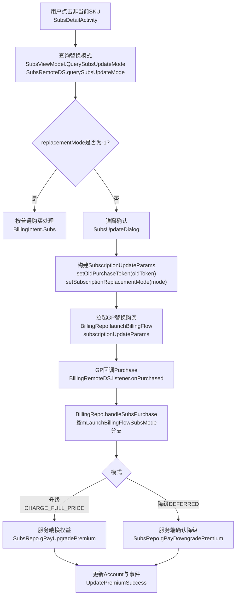
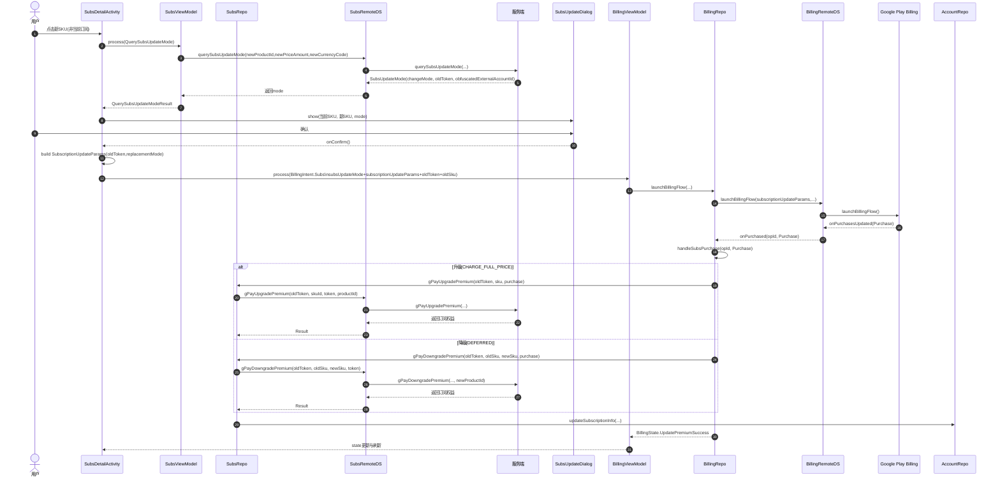
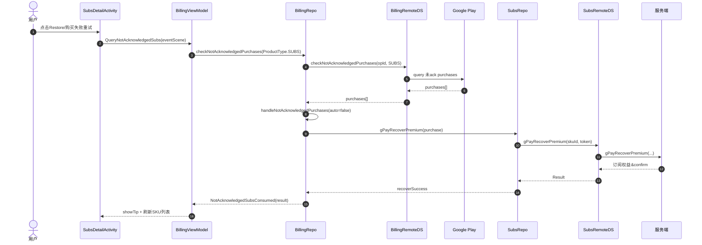

# 订阅设计文档（订阅商品获取）

## 1. 订阅商品（SKU）如何获取：服务端与 Google Play 的关系

项目里的订阅商品不是“只靠 Google Play 拉一份列表就能卖”，而是 **服务端先决定卖什么（商品清单 + 权益信息）**，客户端再用这份清单去 **Google Play 补全可支付的商品详情（价格、offer 等）**。两者是“交集关系”：

- 服务端下发 `SubsSku` 列表：定义“要展示/售卖哪些订阅商品”以及“购买后应该给什么权益/币/奖励”等业务信息。
- Google Play 返回 `ProductDetails/SkuDetails`：提供“这个商品在当前账号/国家/币种下的真实可支付信息”，并决定能否拉起 BillingFlow。
- 客户端以 `SubsSku.skuId == ProductDetails.productId`（或旧版 `SkuDetails.sku`）为唯一对齐键，把两份信息合并成可展示、可购买的 SKU。

### 1.1 两个 ID：skuId vs productId（最容易混的点）

订阅 SKU 模型在 [SubsSku.kt](file:///d:/trea-workspace/shortTV/app/src/main/java/com/startshorts/androidplayer/bean/subs/SubsSku.kt)：

- `skuId`：Google Play 的订阅 Product ID（Billing 查询、拉起支付、以及 purchase 回调里的 `purchase.products[0]` 都使用它）。
- `productId`：服务端侧产品 ID（服务端“换权益/发货”接口用它做业务识别）。

服务端换权益接口会同时带上 `productId` 和 `skuId`（便于服务端做校验/归因/统计），见 [SubsRemoteDS.gPayExchangePremium()](file:///d:/trea-workspace/shortTV/app/src/main/java/com/startshorts/androidplayer/repo/billing/subs/SubsRemoteDS.kt#L40-L57)。

### 1.2 服务端 SKU 列表怎么来（“卖什么”由服务端决定）

订阅页加载时，先请求服务端返回订阅商品列表：

- UI/VM 入口：`SubsViewModel.process(QuerySkuList)` → `loadSkuList()`，见 [SubsViewModel.loadSkuList()](file:///d:/trea-workspace/shortTV/app/src/main/java/com/startshorts/androidplayer/viewmodel/subs/SubsViewModel.kt#L122-L148)
- Repo/DS：`SubsRepo.querySkuList()` → `SubsRemoteDS.querySkuList()`，见 [SubsRepo.querySkuList()](file:///d:/trea-workspace/shortTV/app/src/main/java/com/startshorts/androidplayer/repo/billing/subs/SubsRepo.kt#L54-L56) 与 [SubsRemoteDS.querySkuList()](file:///d:/trea-workspace/shortTV/app/src/main/java/com/startshorts/androidplayer/repo/billing/subs/SubsRemoteDS.kt#L23-L38)
- 接口选择：按“已订阅普通卡”或 AB 开关选择旧接口或 V3 接口（`querySubsSkuList` / `querySubsSkuListV3`），接口声明见 [ApiClient.Service.querySubsSkuList() / querySubsSkuListV3()](file:///d:/trea-workspace/shortTV/app/src/main/java/com/startshorts/androidplayer/manager/api/base/ApiClient.kt#L1035-L1045)

服务端列表回到客户端后，会补充“购买上下文”，例如订阅页场景：

- `sku.source = SubsSku.SCENE_SUBS_DETAIL`
- `sku.receiveType = AccountRepo.getSubscriptionReceiveType()`

见 [SubsViewModel.loadSkuList()](file:///d:/trea-workspace/shortTV/app/src/main/java/com/startshorts/androidplayer/viewmodel/subs/SubsViewModel.kt#L134-L137)。

### 1.3 Google Play 商品详情怎么来（“能不能买/多少钱”由 GP 决定）

拿到服务端 SKU 列表后，客户端会把它转换成 Billing 查询入参，并查询 Google Play 返回的商品详情：

1. 组装待查询的订阅 productId 列表（来自服务端的 `SubsSku.skuId`）：

- `SubsViewModel.queryProducts()`：生成 `Product(BillingClient.ProductType.SUBS, subscriptionIds)`，见 [SubsViewModel.queryProducts()](file:///d:/trea-workspace/shortTV/app/src/main/java/com/startshorts/androidplayer/viewmodel/subs/SubsViewModel.kt#L164-L174)

1. 调用 Billing 查询 `ProductDetails/SkuDetails`：

- `BillingRepo.queryProductDetails(opId, products)` → `BillingRemoteDS.queryProductDetails(...)`，见 [BillingRepo.queryProductDetails()](file:///d:/trea-workspace/shortTV/app/src/main/java/com/startshorts/androidplayer/repo/billing/BillingRepo.kt#L238-L240) 与 [BillingRemoteDS.queryProductDetails()](file:///d:/trea-workspace/shortTV/app/src/main/java/com/startshorts/androidplayer/repo/billing/BillingRemoteDS.kt#L290-L318)

1. 回填到 `SubsSku.skuDetails`，并补齐价格/折扣/offerToken：

- VM 回填入口：`SubsViewModel.handleProductDetailList()`，见 [SubsViewModel.handleProductDetailList()](file:///d:/trea-workspace/shortTV/app/src/main/java/com/startshorts/androidplayer/viewmodel/subs/SubsViewModel.kt#L176-L182)
- 匹配与回填规则：`SubsSku.setSkuDetails(list)`，按 `skuId == ProductDetails.productId`（或 `skuId == SkuDetails.sku`）匹配，见 [SkuExt.kt:SubsSku.setSkuDetails()](file:///d:/trea-workspace/shortTV/app/src/main/java/com/startshorts/androidplayer/utils/ext/SkuExt.kt#L77-L117)

注意：折扣与 offerToken 的选择发生在 `setNormalDetails(ProductDetails)`，会根据 `enableDiscount()` 决定使用哪个 offerToken，见 [SkuExt.kt](file:///d:/trea-workspace/shortTV/app/src/main/java/com/startshorts/androidplayer/utils/ext/SkuExt.kt#L102-L116) 与 [SubsSku.enableDiscount()](file:///d:/trea-workspace/shortTV/app/src/main/java/com/startshorts/androidplayer/bean/subs/SubsSku.kt#L88-L94)。

### 1.4 为什么一定要“服务端 + GP”两段式

- 业务可控：服务端可随时决定“展示哪些 SKU、给什么权益、是否给奖励币、是否 Pro only”等（不依赖发版）。
- 合规与准确：价格/币种/可购买性由 Google Play 决定，客户端展示与支付必须以 GP 返回为准。
- 容灾兜底：当 `skuDetails` 未能成功回填时，部分展示仍可用服务端的 `payAmount/firstAmount` 文案兜底（但支付仍需要 `skuDetails`），模型兜底逻辑见 [SubsSku.kt](file:///d:/trea-workspace/shortTV/app/src/main/java/com/startshorts/androidplayer/bean/subs/SubsSku.kt#L29-L52)。

### 1.5 常见问题（与 SKU 获取直接相关）

- 服务端返回了 SKU，但 Google Play 查不到 `ProductDetails`：通常是 `skuId`（GP Product ID）未在对应应用/包名/渠道配置，或商品未激活/未在该测试账号可见；结果表现为 `skuDetails` 回填失败。
- `skuDetails` 为空导致无法拉起支付：订阅 SKU 必须先完成 `queryProductDetails` 并回填 `SubsSku.skuDetails`，否则拉起支付会失败；项目里也有对应“skuDetails is null”的保护分支（可从订阅链路里定位）。

## 2. 订阅购买流程（普通购买）

普通购买的主链路可以理解为：**UI 选中 SKU → 拉起 Google Play 支付 → 收到 purchase 回调 → 调服务端换权益 → 更新本地 Account 状态并通知 UI 刷新**。

### 2.1 流程图（总览）

### 2.1.1 时序图（普通购买）

### 2.2 关键步骤拆解（按代码链路）

#### 2.2.1 点击 SKU：拉起支付前的前置条件

- `SubsSku.skuDetails` 需要先在“SKU 获取”阶段通过 `queryProductDetails` 回填成功，否则无法拉起支付（对齐逻辑见 [SkuExt.kt:SubsSku.setSkuDetails()](file:///d:/trea-workspace/shortTV/app/src/main/java/com/startshorts/androidplayer/utils/ext/SkuExt.kt#L77-L117)）。
- `offerToken` 同样依赖 `ProductDetails` 回填时的选择逻辑，见 [SkuExt.kt](file:///d:/trea-workspace/shortTV/app/src/main/java/com/startshorts/androidplayer/utils/ext/SkuExt.kt#L102-L116)。

#### 2.2.2 拉起支付：BillingFlow 参数的关键点

- 拉起支付的最终入口是 `BillingRepo.launchBillingFlow(...)`，会保存本次点击上下文（clickedSku、mode、oldToken 等）用于后续 purchase 回调时对齐。
- Billing 的查询与拉起支付在 [BillingRemoteDS.queryProductDetails()](file:///d:/trea-workspace/shortTV/app/src/main/java/com/startshorts/androidplayer/repo/billing/BillingRemoteDS.kt#L290-L318) 与 [BillingRemoteDS.launchBillingFlow()](file:///d:/trea-workspace/shortTV/app/src/main/java/com/startshorts/androidplayer/repo/billing/BillingRemoteDS.kt#L353-L409)。
- `obfuscatedAccountId` 来源：默认使用 `SubsSku.getPayPendingSubsSku()`（要求升降级 2 个商品保持一致），见 [SubsSku.getPayPendingSubsSku()](file:///d:/trea-workspace/shortTV/app/src/main/java/com/startshorts/androidplayer/bean/subs/SubsSku.kt#L75-L86)。

#### 2.2.3 purchase 回调：订阅分流并调用服务端换权益

- purchase 回调后进入订阅处理：`BillingRepo.handleSubsPurchase(...)`，普通购买会走到 `SubsRepo.gPayExchangePremium(...)`，见 [BillingRepo.handleSubsPurchase()](file:///d:/trea-workspace/shortTV/app/src/main/java/com/startshorts/androidplayer/repo/billing/BillingRepo.kt#L323-L399)。
- 普通购买的服务端换权益接口为：[SubsRemoteDS.gPayExchangePremium()](file:///d:/trea-workspace/shortTV/app/src/main/java/com/startshorts/androidplayer/repo/billing/subs/SubsRemoteDS.kt#L40-L57)。

#### 2.2.4 换权益成功：更新本地订阅状态并通知业务刷新

服务端确认成功后，客户端会更新本地订阅信息（并触发 UI 刷新/解锁态刷新）：

- 更新订阅状态：`AccountRepo.updateSubscriptionInfo(isSubscription=true, subscriptionType, subscriptionEndTime)`
- 通知刷新：`EventBus.post(UserRechargedEvent())`
- 可选 consume：当服务端返回 `subscriptionConfirm=true` 时调用 `BillingRepo.consume(ProductType.SUBS, purchaseToken)`

以上更新流程可从 [SubsRepo.gPayExchangePremium()](file:///d:/trea-workspace/shortTV/app/src/main/java/com/startshorts/androidplayer/repo/billing/subs/SubsRepo.kt#L74-L119)（升级/降级同结构）看到完整闭环。

## 3. 订阅升级/降级实现

升级/降级的本质是 Google Play 的“订阅替换（Subscription Update）”。项目里采用 **服务端决策替换模式** 的方式：客户端在用户点击新 SKU 后，先问服务端“这次是升级还是降级，应该用哪种 ReplacementMode，以及旧订阅 token 是什么”，再由客户端按服务端返回构造 `SubscriptionUpdateParams` 并拉起 GP 的替换购买。

### 3.1 关键数据与模式定义

- 模式数据结构：`SubsUpdateMode(changeMode, oldToken, obfuscatedExternalAccountId)`，见 [SubsUpdateMode.kt](file:///d:/trea-workspace/shortTV/app/src/main/java/com/startshorts/androidplayer/bean/subs/SubsUpdateMode.kt)
- 与 GP ReplacementMode 的映射：
  - `UPDATE_MODE_CHANGE_FULL_PRICE` → `CHARGE_FULL_PRICE`（升级立即生效）
  - `UPDATE_MODE_DEFERRED` → `DEFERRED`（降级延迟生效）
  - 其它 → `-1`（视为普通购买）
    见 [SubsUpdateMode.getSubscriptionReplacementMode()](file:///d:/trea-workspace/shortTV/app/src/main/java/com/startshorts/androidplayer/bean/subs/SubsUpdateMode.kt#L17-L31)
- `oldToken`：当前订阅的 purchaseToken（由服务端返回），用于：
  - 构建 `SubscriptionUpdateParams.setOldPurchaseToken(oldToken)`
  - 回传服务端升级/降级接口做校验与幂等

### 3.2 替换模式查询（服务端决策）

点击新 SKU 后，客户端会组装新 SKU 的价格信息（含折扣时用折扣价），调用服务端接口 `querySubsUpdateMode`：

- VM 入口：见 [SubsViewModel.querySubsUpdateMode()](file:///d:/trea-workspace/shortTV/app/src/main/java/com/startshorts/androidplayer/viewmodel/subs/SubsViewModel.kt#L196-L219)
- 价格选择逻辑：`enableDiscount()` 且折扣价 micros 不为 0 才使用折扣价（否则用原价），见 [SubsRemoteDS.querySubsUpdateMode()](file:///d:/trea-workspace/shortTV/app/src/main/java/com/startshorts/androidplayer/repo/billing/subs/SubsRemoteDS.kt#L112-L121)
- 接口：见 [SubsRemoteDS.querySubsUpdateMode()](file:///d:/trea-workspace/shortTV/app/src/main/java/com/startshorts/androidplayer/repo/billing/subs/SubsRemoteDS.kt#L112-L122)

### 3.3 流程图（升级/降级总览）

### 3.4 时序图（升级/降级）

### 3.5 关键实现点与坑

- 降级回调的 `purchase.products[0]` 可能是“旧商品 skuId”：代码里明确写了“正常情况下，降级时回调的 skuId 应该是降级前商品的 skuId”，因此 `handleSubsPurchase` 会在 DEFERRED 模式下校验 `clickedSku.skuId != gpSkuId`，并依赖 `oldSku/oldToken` 来调用 `gPayDowngradePremium`，见 [BillingRepo.handleSubsPurchase()](file:///d:/trea-workspace/shortTV/app/src/main/java/com/startshorts/androidplayer/repo/billing/BillingRepo.kt#L356-L389)。
- 服务端接口参数差异：
  - 升级：`gPayUpgradePremium(oldToken, productId, skuId, token, ...)`，见 [SubsRemoteDS.gPayUpgradePremium()](file:///d:/trea-workspace/shortTV/app/src/main/java/com/startshorts/androidplayer/repo/billing/subs/SubsRemoteDS.kt#L65-L83)
  - 降级：以旧 SKU 为主体参数 + `newProductId`，见 [SubsRemoteDS.gPayDowngradePremium()](file:///d:/trea-workspace/shortTV/app/src/main/java/com/startshorts/androidplayer/repo/billing/subs/SubsRemoteDS.kt#L85-L106)
- `obfuscatedAccountId` 一致性：`SubsSku.getPayPendingSubsSku()` 明确要求“订阅升降级需要保证 2 个商品的 obfuscatedAccountId 值一致”，见 [SubsSku.getPayPendingSubsSku()](file:///d:/trea-workspace/shortTV/app/src/main/java/com/startshorts/androidplayer/bean/subs/SubsSku.kt#L75-L86)。实际替换购买时，服务端也可能返回 `obfuscatedExternalAccountId` 用于覆盖默认值（见 [SubsDetailActivity.handleQuerySubsUpdateModeResult()](file:///d:/trea-workspace/shortTV/app/src/main/java/com/startshorts/androidplayer/ui/activity/subs/SubsDetailActivity.kt#L349-L374)）。

### 3.6 降级“何时切换”（GP 切换 vs 服务端/客户端口径）

降级使用 `ReplacementMode.DEFERRED` 时，**Google Play 的行为是：旧订阅继续生效到当前计费周期结束，之后才切换到新订阅**。因此：

- Google Play：负责“在到期点切换套餐”
- 服务端：负责“识别 GP 已切换，并更新账号订阅口径”
- 客户端：负责“拉取服务端最新账号口径并展示”

#### 3.6.1 服务端何时切换

客户端发起降级时会调用 `gPayDowngradePremium(...)`，服务端通常会记录“降级请求/目标商品”，但此刻 **账号当前有效订阅仍然是旧套餐**（因为 GP 还没到切换点）。

当到达当前订阅周期结束，GP 完成切换后，服务端通过（常见做法）：

- 接收 Google Play 的订阅状态变更通知（例如 RTDN），或
- 主动查询 Google Play 订阅状态（用 token 校验并获取当前有效套餐）

来更新账号的 `subscriptionType/subscriptionEndTime/isSubscription` 等字段；从客户端视角，服务端“切换完成”的标志是下一次拉取账号信息时返回了新的订阅口径。

#### 3.6.2 客户端何时切换

客户端不会自己根据时间“手动改成新套餐”，而是依赖账号刷新：

- `AccountRepo.refreshUserInfo()` 会以服务端返回为准更新本地订阅字段（包含 `isSubscription/subscriptionType/subscriptionEndTime`），见 [AccountRepo.refreshUserInfo()](file:///d:/trea-workspace/shortTV/app/src/main/java/com/startshorts/androidplayer/repo/account/AccountRepo.kt#L374-L418)。
- 为了尽快同步“到期边界”的变化，项目会在订阅已过期或距离到期很近时启动轮询刷新账号（每 30 秒，最多 5 次），见 [AccountManager.startCheckSubsRenewJob()](file:///d:/trea-workspace/shortTV/app/src/main/java/com/startshorts/androidplayer/manager/account/AccountManager.kt#L250-L272)。

因此，降级切换的最终表现是：**GP 在到期点切换 → 服务端更新账号订阅口径 → 客户端下一次 refreshUserInfo/轮询刷新后展示为新套餐**。

## 4. 恢复/补单（丢单处理）

这里的“恢复/补单”主要处理两类情况：

- 用户已在 Google Play 完成扣款，但由于异常（网络、App 被杀、回调丢失、服务端调用失败等）导致“服务端未成功换权益/客户端未及时刷新”
- 用户再次点击购买时 GP 返回 `ITEM_ALREADY_OWNED`，说明当前账号下存在未完成闭环的购买记录（常见是未 ack/未消耗），需要先走补单

项目实现的关键点是：**从 Google Play 查询未 ack 的 Purchase → 调服务端 recover 接口换权益 → 成功后 consume/ack → 更新本地账号与 UI**。

### 4.1 手动恢复入口（订阅页）

订阅详情页提供“Restore/恢复”入口：

- 点击“恢复”：触发 [SubsDetailActivity.tryRestore()](file:///d:/trea-workspace/shortTV/app/src/main/java/com/startshorts/androidplayer/ui/activity/subs/SubsDetailActivity.kt#L293-L327)，最终发起 `BillingIntent.QueryNotAcknowledgedSubs(eventScene)`
- 购买失败弹窗的“重试”同样走恢复逻辑：见 [SubsDetailActivity.showPurchaseFailedTipDialog()](file:///d:/trea-workspace/shortTV/app/src/main/java/com/startshorts/androidplayer/ui/activity/subs/SubsDetailActivity.kt#L310-L319)

### 4.2 自动补单触发（ITEM\_ALREADY\_OWNED）

当下单失败且错误码为 `ITEM_ALREADY_OWNED` 时，会自动触发一次补单扫描：

- 触发点：在 billing 错误回调里检测到 `ErrorCode.ITEM_ALREADY_OWNED` 后，调用 `checkNotAcknowledgedPurchases(createOpId())`，见 [BillingRemoteDS](file:///d:/trea-workspace/shortTV/app/src/main/java/com/startshorts/androidplayer/repo/billing/BillingRemoteDS.kt#L150-L204)
- 扫描逻辑：连接正常时调用 `mBillingClient.checkNotAcknowledgedPurchases()`，见 [BillingRemoteDS.checkNotAcknowledgedPurchases()](file:///d:/trea-workspace/shortTV/app/src/main/java/com/startshorts/androidplayer/repo/billing/BillingRemoteDS.kt#L320-L332)
- 扫描结果回调：`onNotAcknowledgedPurchasesFind(list)` → 交给 `BillingRepo.handleNotAcknowledgedPurchases(auto=true, ...)` 处理，见 [BillingRepo](file:///d:/trea-workspace/shortTV/app/src/main/java/com/startshorts/androidplayer/repo/billing/BillingRepo.kt#L61-L97)

### 4.3 自动补单触发（首次 connect 后扫描）

除了 `ITEM_ALREADY_OWNED` 之外，项目还会在 **首次连接 Google Play Billing 成功后** 自动扫描一次未完成订单：

- 触发点：`BillingRemoteDS.connect(firstConnect=true, ...)` 连接成功且 `checkConnection(opId)` 通过后，会调用 `checkNotAcknowledgedPurchases(createOpId())`，见 [BillingRemoteDS.connect()](file:///d:/trea-workspace/shortTV/app/src/main/java/com/startshorts/androidplayer/repo/billing/BillingRemoteDS.kt#L66-L87)
- “首次”的含义：`firstConnect` 由 `BillingViewModel` 维护，首次 `onSetupFinished()` 后会将 `mFirstConnect=false`，见 [BillingViewModel.connect()](file:///d:/trea-workspace/shortTV/app/src/main/java/com/startshorts/androidplayer/viewmodel/billing/BillingViewModel.kt#L180-L186)
- 回调处理：扫描到的未 ack purchases 会走 `BillingRepo` 的 `mNotAcknowledgedPurchaseListener`，最终进入 `handleNotAcknowledgedPurchases(auto=true, ...)`，见 [BillingRepo](file:///d:/trea-workspace/shortTV/app/src/main/java/com/startshorts/androidplayer/repo/billing/BillingRepo.kt#L61-L97)

### 4.3 查询未补单 Purchase（GP 本地）

手动恢复（订阅）时，ViewModel 会调用 `BillingRepo.checkNotAcknowledgedPurchases(opId, ProductType.SUBS)` 查询“未 ack 的订阅 Purchase”：

- 入口：`BillingIntent.QueryNotAcknowledgedSubs` → `queryNotAcknowledgedSubs(eventScene)`，见 [BillingViewModel.queryNotAcknowledgedSubs()](file:///d:/trea-workspace/shortTV/app/src/main/java/com/startshorts/androidplayer/viewmodel/billing/BillingViewModel.kt#L387-L401)
- GP 查询：`BillingRepo.checkNotAcknowledgedPurchases(...)` → `BillingRemoteDS.checkNotAcknowledgedPurchases(opId, productType)`，见 [BillingRepo.checkNotAcknowledgedPurchases()](file:///d:/trea-workspace/shortTV/app/src/main/java/com/startshorts/androidplayer/repo/billing/BillingRepo.kt#L246-L248) 与 [BillingRemoteDS.checkNotAcknowledgedPurchases(opId, productType)](file:///d:/trea-workspace/shortTV/app/src/main/java/com/startshorts/androidplayer/repo/billing/BillingRemoteDS.kt#L334-L351)

### 4.4 补单处理（服务端换权益 + consume/ack）

拿到未 ack 的 Purchase 列表后，统一走 `BillingRepo.handleNotAcknowledgedPurchases(...)`：

- 按 `purchase.products[0]` 是否包含 `.subs.` 将 Purchase 分为订阅/内购两类，见 [BillingRepo.handleNotAcknowledgedPurchases()](file:///d:/trea-workspace/shortTV/app/src/main/java/com/startshorts/androidplayer/repo/billing/BillingRepo.kt#L497-L565)
- 订阅补单：`SubsRepo.gPayRecoverPremium(auto, eventScene, subsSku, purchase)`，见 [SubsRepo.gPayRecoverPremium()](file:///d:/trea-workspace/shortTV/app/src/main/java/com/startshorts/androidplayer/repo/billing/subs/SubsRepo.kt#L215-L255)
  - 服务端接口：`ApiClient.service.gPayRecoverPremium(skuId, token)`，见 [SubsRemoteDS.gPayRecoverPremium()](file:///d:/trea-workspace/shortTV/app/src/main/java/com/startshorts/androidplayer/repo/billing/subs/SubsRemoteDS.kt#L59-L63)
  - 成功后更新本地账号：`AccountRepo.updateSubscriptionInfo(...)` + `EventBus.post(UserRechargedEvent())`
  - 如服务端返回 `subscriptionConfirm=true`，会调用 `BillingRepo.consume(ProductType.SUBS, purchaseToken)` 完成消耗/确认（避免反复补单）
- 内购补单：会组装 `GPayCoinsRecover` 列表并调用 `PurchaseRepo.gPayCoinsRecover(...)`（订阅文档不展开，代码入口同上）

### 4.5 UI 与提示（订阅页）

订阅页对补单结果的 UI 处理：

- 找不到丢单：`BillingState.NotExistNotAcknowledgedSubs` → toast “未找到丢单”，见 [SubsDetailActivity](file:///d:/trea-workspace/shortTV/app/src/main/java/com/startshorts/androidplayer/ui/activity/subs/SubsDetailActivity.kt#L195-L208)
- 补单成功：`BillingState.NotAcknowledgedSubsConsumed(result)` → `result.showTip()` + 若包含订阅则刷新 SKU 列表，见同段代码

## 5. 续期/过期刷新（订阅状态同步）

订阅的续期/到期发生在 Google Play 侧（尤其是自动续费、到期取消、降级到期切换等），客户端需要在“到期边界”尽快把 **服务端口径** 同步到本地，避免出现：

- 实际已续期但客户端仍显示“已过期/未订阅”
- 实际已到期但客户端仍显示“订阅中”
- 降级 DEFERRED 到期切换后，客户端没有及时展示新套餐

项目采用 **到期边界轮询 refreshUserInfo** 的方式做同步。

### 5.1 轮询触发条件（到期/临近到期）

统一入口为 `AccountManager.startCheckSubsRenewJob()`，它只会在满足下述条件时启动轮询：

- 已过期：`AccountRepo.isSubsExpired() == true`
- 临近到期：`AccountRepo.hasSubscribed() == true` 且 `subscriptionEndTime - now < 2 分钟`

见 [AccountManager.startCheckSubsRenewJob()](file:///d:/trea-workspace/shortTV/app/src/main/java/com/startshorts/androidplayer/manager/account/AccountManager.kt#L250-L273)

“已过期”的判定包含一种特殊情况：即使 `isSubscription=false`，只要本地仍保留了 `subscriptionEndTime != -1` 也会认为处于“订阅过期态”，见 [AccountLocalDS.isSubsExpired()](file:///d:/trea-workspace/shortTV/app/src/main/java/com/startshorts/androidplayer/repo/account/AccountLocalDS.kt#L264-L273)。

### 5.2 轮询策略（30s \* 最多 5 次）

- 间隔：`CHECK_SUBS_RENEW_INTERVAL = 30s`
- 次数上限：`MAX_CHECK_SUBS_RENEW_COUNT = 5`（最多约 2.5 分钟）
- 若一开始已过期，会先立刻 `refreshUserInfo()` 一次，然后再开始定时轮询
- 在轮询过程中：
  - 如果刷新后发现订阅恢复正常，且 `subscriptionEndTime - now > 2 分钟`，会自动停止轮询
  - 如果达到次数上限也会停止

见 [AccountManager](file:///d:/trea-workspace/shortTV/app/src/main/java/com/startshorts/androidplayer/manager/account/AccountManager.kt#L49-L60) 与 [startCheckSubsRenewJob()](file:///d:/trea-workspace/shortTV/app/src/main/java/com/startshorts/androidplayer/manager/account/AccountManager.kt#L250-L281)

### 5.3 谁会触发 startCheckSubsRenewJob

该 job 并不是“App 启动必跑”，而是由业务页面/功能在合适的时机触发：

- 个人中心：`ProfileFragment.onResume()` 会调用 `AccountManager.startCheckSubsRenewJob()`，见 [ProfileFragment.onResume()](file:///d:/trea-workspace/shortTV/app/src/main/java/com/startshorts/androidplayer/ui/fragment/profile/ProfileFragment.kt#L181-L200)
- 订阅页：`SubsDetailActivity.onCreate()` 会调用 `AccountManager.startCheckSubsRenewJob()`，见 [SubsDetailActivity.onCreate()](file:///d:/trea-workspace/shortTV/app/src/main/java/com/startshorts/androidplayer/ui/activity/subs/SubsDetailActivity.kt#L219-L237)
- 播放器场景（Pro）：Immersion 的 `SubsProRenewFeature` 每 30s 触发一次 `AccountManager.startCheckSubsRenewJob()`（内部会判断是否需要真正启动），见 [SubsProRenewFeature](file:///d:/trea-workspace/shortTV/app/src/main/java/com/startshorts/androidplayer/manager/immersion/feature/SubsProRenewFeature.kt#L7-L21)

### 5.4 refreshUserInfo 如何更新本地并触发 UI

轮询本质是调用 `AccountRepo.refreshUserInfo()` 获取服务端口径，并更新本地订阅字段：

- `AccountRepo.refreshUserInfo()` 会根据服务端返回更新 `isSubscription/subscriptionType/subscriptionEndTime`，见 [AccountRepo.refreshUserInfo()](file:///d:/trea-workspace/shortTV/app/src/main/java/com/startshorts/androidplayer/repo/account/AccountRepo.kt#L374-L418)
- 特殊处理：当本地处于“过期态”（`isSubsExpired()==true`），且服务端返回 `isSubscription=true`（例如续期延长），会先把本地 `isSubscription=false` 再设回 `true`，以确保订阅属性变化能触发 UI 更新（代码里已注明原因），见同段实现

### 5.5 什么时候主动取消轮询

在“支付闭环已完成、订阅口径已被更新”时会主动停止轮询，避免重复刷新：

- 普通订阅购买成功：`SubsRepo.gPayExchangePremium()` 成功后 `AccountManager.cancelCheckSubsRenewJob()`，见 [SubsRepo.gPayExchangePremium()](file:///d:/trea-workspace/shortTV/app/src/main/java/com/startshorts/androidplayer/repo/billing/subs/SubsRepo.kt#L80-L106)
- 升级/降级成功：`SubsRepo.gPayUpgradePremium()/gPayDowngradePremium()` 成功后取消轮询，见 [SubsRepo](file:///d:/trea-workspace/shortTV/app/src/main/java/com/startshorts/androidplayer/repo/billing/subs/SubsRepo.kt#L121-L213)
- 补单成功：`SubsRepo.gPayRecoverPremium()` 成功后取消轮询，见 [SubsRepo.gPayRecoverPremium()](file:///d:/trea-workspace/shortTV/app/src/main/java/com/startshorts/androidplayer/repo/billing/subs/SubsRepo.kt#L215-L235)

### 5.6 辅助刷新：SKU 列表与账号口径不一致

在订阅 SKU 列表渲染时，如果出现“本地显示未订阅，但 SKU 列表里标记 `inSubscription=true`”，会强制刷新一次账号信息并更新 UI：

- 条件：`!AccountRepo.hasSubscribed() && subsSku.inSubscription == true`
- 动作：`AccountRepo.refreshUserInfo(force=true)`，成功后 `notifyItemChanged(0)`

见 [SubsTypeView.checkRefreshSubsExpiredTime()](file:///d:/trea-workspace/shortTV/app/src/main/java/com/startshorts/androidplayer/ui/view/subs/SubsTypeView.kt#L138-L146)
